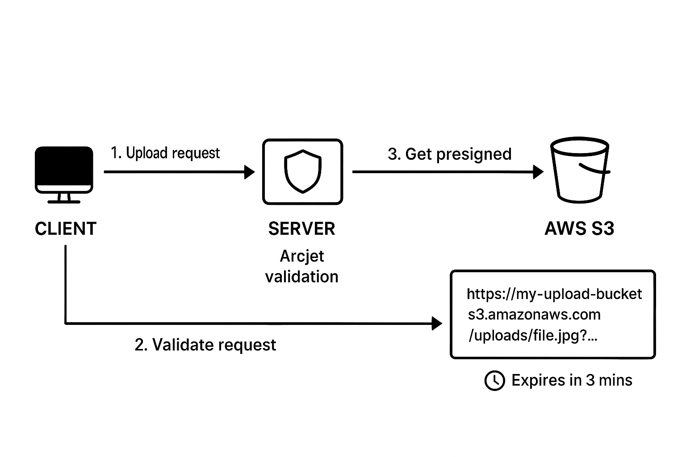

# 🔐 Secure File Upload Architecture (with Arcjet and AWS S3)

This document explains a secure file upload flow where the **client uploads files** via a **server**, which validates requests using **Arcjet** and generates a **temporary AWS S3 presigned URL** (valid for 3 minutes).  
This ensures data integrity, security, and controlled access to storage.

---

## 🧭 Overview

Uploading files directly to the server can expose security risks such as:
- Malicious uploads (e.g., scripts or infected files)
- Unauthorized access to storage
- Server overload due to large file handling

To solve this, we use a **secure delegation model**:

1. The **client** requests permission to upload.
2. The **server** (protected by Arcjet) validates and signs a request.
3. The **server** asks **AWS S3** for a **presigned upload URL**.
4. The **server** returns this **temporary URL** to the client.
5. The **client** uploads directly to **S3** using that URL.
6. The **URL expires in 3 minutes**, preventing future misuse.

---

## 🧱 Architecture Diagram

**Explanation of the diagram:**
- **Client:** The user’s browser or application.
- **Server:** Your Next.js or Node.js backend using Arcjet to analyze the upload request.
- **AWS S3:** Secure cloud storage service holding your uploaded files.

**Flow:**
1. Client → Server: Upload request (file metadata or upload intent).
2. Server → Arcjet: Request analyzed for suspicious patterns (bot, large file, malicious intent).
3. Server → AWS S3: Request for a presigned URL (temporary upload permission).
4. AWS S3 → Server: Returns presigned URL (valid for 3 minutes).
5. Server → Client: Sends presigned URL.
6. Client → AWS S3: Uploads file directly to S3 using that URL.
7. URL expires automatically after 3 minutes, ensuring security.

---

## ⚙️ What is a Presigned URL?

A **presigned URL** is a special, time-limited link generated by AWS S3 that allows anyone with the link to **upload or download** a file **without needing AWS credentials**.

- It is created by your **server**, which has AWS permissions.
- It is valid for a **short time** (e.g., 3 minutes).
- It allows only **specific operations** (e.g., PUT for upload, GET for download).
- Once it expires, it **cannot be reused**.

---

## 🧠 Why 3 Minutes?

The **3-minute expiry** ensures:
- Upload links cannot be shared or abused.
- If a user leaves the page idle, the upload link becomes invalid.
- Attackers have an extremely short window to attempt misuse.

This short lifespan enforces **least privilege** and **temporal security**.

---

## 🧰 Role of Arcjet (Security Layer)

**Arcjet** adds an **intelligent security layer** before your server even requests the S3 URL.  
It performs:
- Rate limiting (prevents spam or bot uploads)
- Payload analysis (detects malicious patterns)
- IP or region filtering (blocks suspicious requests)
- Input sanitization and anomaly detection

If the request fails validation, **the presigned URL is never generated** — keeping your S3 storage isolated and safe.

---

## ☁️ Understanding AWS S3 Buckets

An **S3 bucket** is like a **secure folder** in the cloud:
- Each file (object) lives inside a bucket.
- Buckets have unique names globally (e.g., `myapp-uploads`).
- You can configure **permissions**, **encryption**, **lifecycle rules**, and **public access settings**.

For security:
- Buckets used for presigned uploads should be **private**.
- Only presigned URLs should grant temporary access.

---

## 🔐 Security Benefits of This Architecture

| Concern | How It's Solved |
|----------|-----------------|
| Malicious uploads | Arcjet analyzes and rejects unsafe requests |
| Exposing AWS credentials | Client never sees AWS keys |
| Excessive storage use | URLs expire automatically |
| Data leaks | S3 bucket remains private |
| Replay attacks | URLs expire after 3 minutes |
| Server overload | Upload bypasses your server directly to S3 |

---

## 🧩 Summary

| Component | Responsibility |
|------------|----------------|
| **Client** | Requests upload URL, uploads to S3 |
| **Server** | Validates (Arcjet), generates presigned URL |
| **AWS S3** | Stores uploaded file, enforces expiration |
| **Arcjet** | Adds rate-limiting and request validation |

**Result:**  
> A fast, secure, and scalable upload system — where the server controls who can upload, and S3 safely stores the data without exposing secrets.

---

*Author: Sam Mariga*  
*Date: October 2025*  
